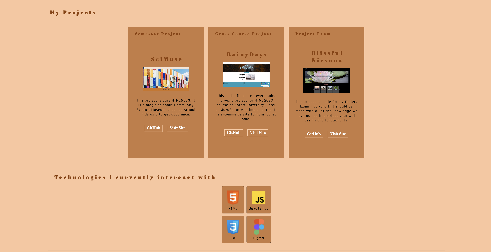

# Portfolio



This project is made as a last project of the first year of my studies at Noroff.

## Description
This Portfolio is made as a last project of my first year studying Front-End Development at Noroff. It includes my work au until now, experience I have and all the neccesary informations about me and about contacting me.

## Built With

This project has been made interactiv, and for that I have been using:

- HTML(https://developer.mozilla.org/en-US/docs/Web/HTML)
- CSS (https://developer.mozilla.org/en-US/docs/Web/CSS)
- JavaScript (https://developer.mozilla.org/en-US/docs/Web/JavaScript)

## Getting Started

### Installing

1. Clone the repo:

```bash
git clone git@github.com:vanya992/Blissful-Nirvana.git
```

2. Install the dependencies:

```bash
npm install
```

### Running

To run the app, run the following commands:

```bash
npm run start
```

## Contributing

Feel free to contact me if you find my profile interesting.

## Contact


You can contact me through my linkedin profile: (https://www.linkedin.com/in/vladimira-dmitrovic-090183249/);

